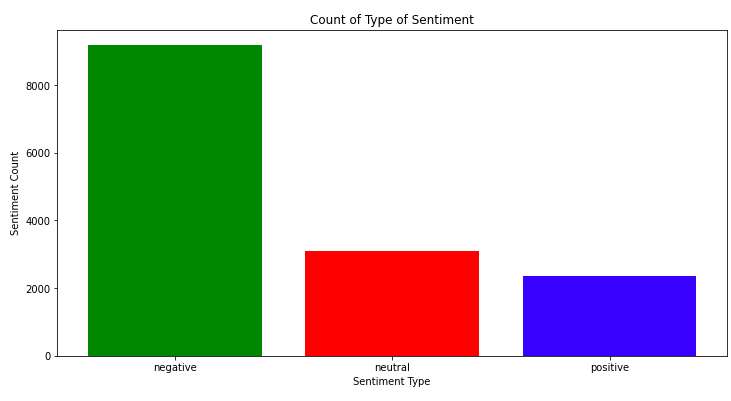
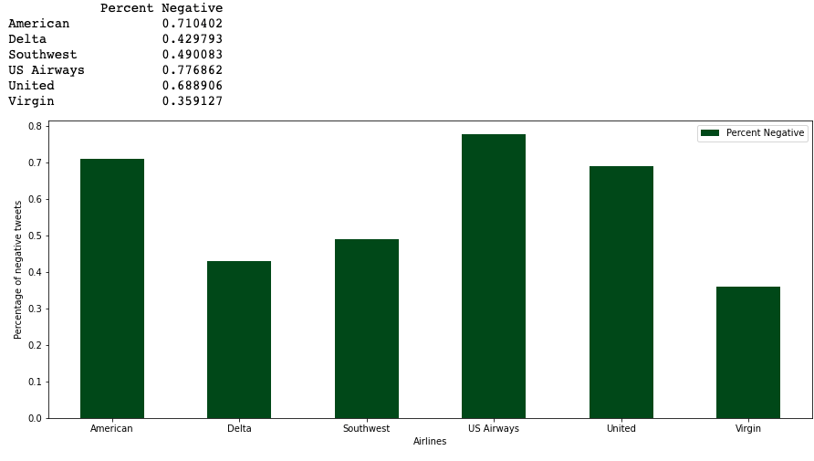
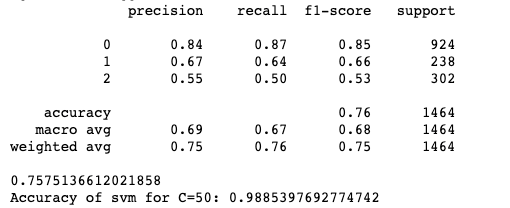
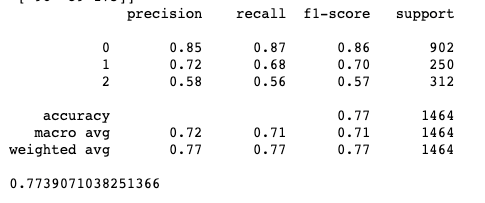

# Sentiment Analysis USairline

The aim of this repository was to analyze how travelers have felt about the various us airlines. They have tweeted about feelings in February 2015. The dataset was acquired by kaggle website. Its also present in the repository.

## Data Visulization

 

## Data Preprocessing
1. Remove stopwords
2. Remove Mentions
3. Remove hashtags
4. Remove http
5. Convert to lower case
6. Remove puntuation

## Vectorization
1. tf-idf
2. word2Vec

## Algorithms Used
1. SVM
2. Naive Bayes
3. LSTM
4. CNN
5. Feed Forward Network

## Results

After implementing the multiple machine learning algorithms and deep learning methods found out that support vectors machines give better results compared to other algorithms and feed forward networks perform better than LSTM and CNN

   
